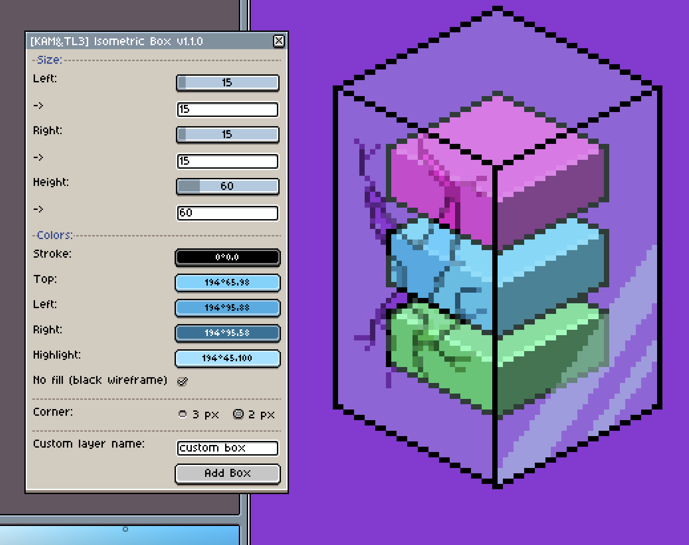

# Isometric Box Generator for Aseprite
This script lets you create boxes of various sizes in [Aseprite](https://www.aseprite.org/):

You can set a custom color for each of the sides of the box. By default it will generate shades of your current foreground color.

You can set a custom color for each of the sides, set a highlight and stroke color. You can also choose between two types of the corners: 2px and 3px. You can read more about the differences [here](http://www.gas13.ru/v3/tutorials/isometric_pixelart_tutorial_the_two_types.php).

## Features:
    + Customize X, Y and Z size of the box
    + Customize colors for each side of the box
    + Custom Stroke and Highlight colors
    + Two types of the box: 3px and 2px corner

## New features:
    + Wireframe mode for outlining
    + Custom layer naming and auto increment
    + Improved size setting ui
    + Auto centering boxes
    + Auto update of color palette with fg

## Requirements:
- >= [Aseprite 1.2.10-beta2+](https://www.aseprite.org/)
- Color Mode: RGBA

## Installation:
1. Open Aseprite
2. Go to `File → Scripts → Open Scripts Folder`
3. Place downloaded LUA file into folder
4. Reload scripts (menu or press F5)

You will find installed scripts under `File → Scripts` menu. You can add shortcuts to each script under `Edit → Keyboard Shortcuts`

---

## About this project

This is a major and near complete overhaul fork of https://github.com/darkwark/isobox-for-aseprite

